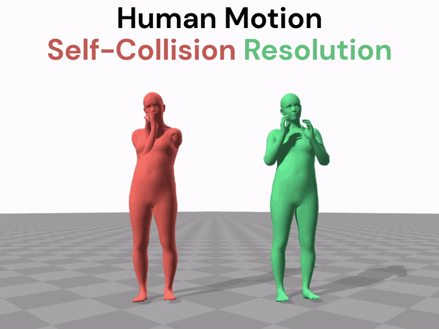
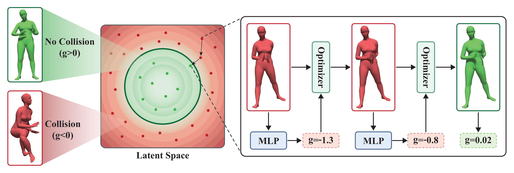

# PoseShield: Neural Collision Fields for Human Self-Collision Resolution (ECCV 2026)

<p align="center">
  Zhengyuan Li<sup>1</sup>&emsp;
  Zeyun Deng<sup>1</sup>&emsp;
  Yifan Shen<sup>3</sup>&emsp;
  Liangyan Gui<sup>3</sup>&emsp;
  Miaolan Xie<sup>1</sup>&emsp;
  <br>
  Joseph Campbell<sup>1</sup>&emsp;
  Xifeng Gao<sup>2</sup>&emsp;
  Kui Wu<sup>2</sup>&emsp;
  Zherong Pan<sup>2</sup>&emsp;
  Aniket Bera<sup>1</sup>&emsp;
  <br><br>
  <sup>1</sup>Purdue University&emsp;
  <sup>2</sup>LightSpeed Studios&emsp;
  <sup>3</sup>University of Illinois Urbana-Champaign
</p>

<p align="center">
  <a href="https://arxiv.org/abs/2606.29686"></a>
</p>

<p align="center">
  
</p>

**PoseShield** is a post-hoc self-collision resolver for SMPL-H poses and
human motion sequences. It uses a learned neural collision field as a
differentiable constraint, so existing poses and motions can be repaired as a
post-processing step without even knowing the upstream system that produced
them.

## What Is Included

- [x] Quick pose and motion demos with released checkpoints.
- [x] Humans with Collisions (HwC) data for training, evaluation, and the 500-pose benchmark.
- [x] Exact-FCL validation plus HTML and optional Blender visualization.
- [x] Experimental shape-aware SAField demo that resolves a fixed sample and exports OBJ meshes.
- [ ] Evaluation on self-colliding human motion sequences.

## Overview

<p align="center">
  
</p>

PoseShield treats self-collision correction as a post-hoc optimization problem:
given a self-intersecting SMPL-H pose or motion, find a nearby collision-free
result while preserving the original pose semantics and motion dynamics.
The input can come from a generative model, motion capture cleanup pipeline,
dataset preprocessing workflow, or any other source that can be represented in
the public SMPL-H/HY-Motion-compatible layouts below.

The core component is a neural collision field defined directly in SMPL-H pose
space. The field is trained to be positive for collision-free poses and negative
for self-intersecting poses, so it can be used as a differentiable collision
constraint. We regularize this field with an Eikonal-style objective, encouraging
non-vanishing gradients near the collision boundary and making gradient-based
optimization more stable.

At inference time, PoseShield uses this learned field in two ways:

- For single poses, it solves a constrained optimization problem that minimally
  changes the input SMPL-H body rotations while moving the pose into the
  collision-free region.
- For motion sequences, it reuses the same learned collision field inside a
  two-stage latent optimization pipeline: Stage 1 fits the motion model latent
  to the input sequence, and Stage 2 resolves self-collisions while preserving
  hand motion, temporal dynamics, and the original global translation.

## Limitations

The main method studied in the paper assumes the neutral SMPL-H body model with
`betas=None`; subject-specific body-shape parameters are not passed to the
SMPL-H layer. To apply the method to other SMPL body shapes, character-specific
SMPL humans, Momentum Human Rig, or other human parametric models, users may
need to build a custom collision dataset for the target body model and retrain
the collision field. In this release, we include a preliminary experimental
shape-aware collision-field feature as an initial step beyond the paper setting.

## Getting Started

### 1. Environment Setup

```bash
conda env create -f environment.yml
conda activate poseshield
pip install -e .
```

We test the code on Python 3.10 and PyTorch with CUDA. The release
`environment.yml` pins the dependency versions that are most likely to affect
reproducibility, including PyTorch, NumPy, python-fcl, transformers, and
diffusers.

### 2. Download SMPL+H Body Models

Register and download the Extended SMPL+H model from the [MANO website](https://mano.is.tue.mpg.de/).

```bash
mkdir -p deps/body_models/smplh
cp smplh/neutral/model.npz deps/body_models/smplh/SMPLH_NEUTRAL.npz
```

PoseShield currently uses the neutral SMPL-H model.

### 3. Download Release Assets

Download and extract the PoseShield external assets at the repository root:

```bash
unzip PoseShield_release_dependencies_20260628.zip -d .
unzip PoseShield_release_pose_data_20260628.zip -d .
unzip PoseShield_release_motion_data_20260628.zip -d .
unzip PoseShield_release_safield_demo_20260703.zip -d .  # optional experimental SAField demo
```

The release asset packages are available from the
[PoseShield Google Drive folder](https://drive.google.com/drive/folders/1gLdFy4OTfYaKeaZ3olqShyh3kF2m5ogf?usp=sharing).

Validate the asset layout with:

```bash
python tools/check_assets.py
```

<details>
<summary><b>Release Asset Contents and Expected Layout</b></summary>

<br>

The dependency package provides PoseShield checkpoints, HY-Motion normalization
statistics, and the exact-FCL mesh distance table:

| File | Destination | Description |
|------|-------------|-------------|
| `model.pth` | `ckpts/poseshield/` | Collision field checkpoint |
| `config.yaml` | `ckpts/poseshield/` | Collision field config |
| `model_elu.pth` | `ckpts/poseshield/` | ELU collision field for motion resolution |
| `config_elu.yaml` | `ckpts/poseshield/` | ELU collision field config |
| `distances.pkl` | `deps/` | Mesh topology distances for exact-FCL checks |
| `Mean.npy`, `Std.npy` | `ckpts/tencent/HY-Motion-1.0-Lite/stats/` | HY-Motion normalization statistics |

For motion-level resolution, also download
[HY-Motion-1.0-Lite](https://github.com/Tencent-Hunyuan/HY-Motion-1.0).
Its checkpoint and config are not included in the PoseShield asset zip and
should be placed under `ckpts/tencent/HY-Motion-1.0-Lite/`.

The pose data package provides the released **Humans with Collisions (HwC)**
pose dataset. `data/dataset/` is used for collision-field training and
classification evaluation. `data/dataset_test/` contains the 500 self-colliding
pose benchmark subset used by the pose-level collision-resolution script.

The motion data package provides 100 canonical MotionFix motion samples under
`data/motion_canonical/`. The optional SAField package provides the experimental
shape-aware checkpoint under `experimental/safield_demo/`; the matching config
is included in the repository.

After downloading the release assets, the main required files should look like:

```text
deps/
+-- body_models/
|   +-- smplh/
|       +-- SMPLH_NEUTRAL.npz
+-- distances.pkl
data/
+-- dataset/                     # Humans with Collisions (HwC) train/test data
|   +-- train_list.csv
|   +-- test_list.csv
|   +-- augmented_data/
|   |   +-- *.npz
|   +-- gt_data/
|       +-- *.npz
+-- dataset_test/                # HwC 500-pose collision-resolution benchmark
|   +-- *.pkl
|   +-- *.obj
|   +-- *.png
+-- motion_canonical/            # 100 canonical MotionFix motion sequences
    +-- motionfix_*_135.npy
ckpts/
+-- poseshield/
|   +-- config.yaml
|   +-- config_elu.yaml
|   +-- model.pth
|   +-- model_elu.pth
+-- tencent/
    +-- HY-Motion-1.0-Lite/
        +-- latest.ckpt
        +-- config.yaml  # or config.yml
        +-- stats/
            +-- Mean.npy
            +-- Std.npy
experimental/
+-- safield_demo/                # optional experimental shape-aware demo
    +-- sa_model.pth
    +-- sa_config.yaml
```

`tools/check_assets.py` prints present and missing asset groups, and exits with
a non-zero status if any required asset is missing.

</details>

## Demo

Small demo inputs are provided in `demo_asset/`.

### Pose Collision Resolution

```bash
python demos/demo_pose.py
```

Outputs are written to `demos/output/`.

### Motion Collision Resolution

Run the interactive demo:

```bash
bash demos/demo_motion.sh
```

<details>
<summary><b>Run the Two Motion Stages Explicitly</b></summary>

<br>

```bash
SAMPLE=motion_sample2.npy
STEM=${SAMPLE%.npy}

python -m poseshield.hymotion.dno.run_dno_stage1 \
    --model_path ckpts/tencent/HY-Motion-1.0-Lite \
    --motion_file demo_asset/$SAMPLE \
    --output_dir demos/output_motion/$STEM

python -m poseshield.hymotion.dno.run_dno_stage2 \
    --model_path ckpts/tencent/HY-Motion-1.0-Lite \
    --motion_file demo_asset/$SAMPLE \
    --stage1_z demos/output_motion/$STEM/stage1_z.pt \
    --output_dir demos/output_motion/${STEM}_stage2
```

The demo scripts use validated release defaults.

Stage 2 writes:

```text
optimized_motion.npy
optimized_z.pt
summary.json
args.json
```

The optimized motion copies the original absolute translation trajectory and updates only the pose rotations.

</details>

<details>
<summary><b>Motion Data Format</b></summary>

<br>

PoseShield uses different public representations for pose-level and
motion-level code:

- Pose-level detection, training, and optimization operate on a single SMPL-H
  body pose represented as 21 joints × 6D rotations, i.e. shape `[21, 6]` or a
  flattened 126D vector.
- Motion-level inference, evaluation, and visualization operate on a canonical
  HY-Motion-compatible motion array:

```text
shape: [frames, 135]

[0:132]   22 joints × 6D rotations, HY-Motion column-interleaved layout
[132:135] absolute global translation [abs_x, abs_y, abs_z]
```

Coordinate convention:

```text
Y-up
X = right
Y = height/up
Z = forward
frame 0 human facing +Z
```

The optimized motion keeps the original absolute translation trajectory and
updates the pose rotations.

</details>

<details>
<summary><b>Exact Mesh/FCL Collision Check</b></summary>

<br>

```bash
python tools/evaluate_exact_fcl.py \
    --motion demos/output_motion/${STEM}_stage2/optimized_motion.npy \
    --output-dir demos/output_motion/${STEM}_stage2/exact_fcl
```

If exact mesh collisions remain, the tool exits with a non-zero status after writing `exact_fcl_results.json`.
This exact-FCL check is the core geometry-level validation for motion outputs.
A successful demo run should exit with status 0 and report no remaining exact
mesh self-collisions.

</details>

<details>
<summary><b>HTML Visualization</b></summary>

<br>

```bash
python tools/generate_motion_html.py \
    --sequence $STEM \
    --original demo_asset/$SAMPLE \
    --optimized demos/output_motion/${STEM}_stage2/optimized_motion.npy \
    --output-dir demos/output_motion/${STEM}_stage2/visualization
```

Open the generated `*_vis.html` file in a browser.
This is the lightweight visualization path and does not require Blender.

</details>

<details>
<summary><b>Optional Blender MP4 Rendering</b></summary>

<br>

For a higher-quality MP4 render, install Blender manually and use an FFmpeg
build with `libx264` support when possible. Some system FFmpeg modules do not
enable `libx264`, so the script accepts `--ffmpeg-path` and falls back to MPEG-4
encoding if the `libx264 -crf` encode fails.

```bash
python tools/render_motion_blender.py \
    --original demo_asset/$SAMPLE \
    --optimized demos/output_motion/${STEM}_stage2/optimized_motion.npy \
    --output demos/output_motion/${STEM}_stage2/render.mp4 \
    --blender-path /path/to/blender \
    --ffmpeg-path /path/to/ffmpeg
```

Blender/MP4 rendering is optional and is not required for PoseShield evaluation.
The default render colors are red for the original motion and green for the
optimized motion.

</details>

## Evaluation

### Pose-Level Collision Resolution Benchmark

```bash
python poseshield/pose/resolve_dataset_test_slsqp.py \
    --config-path ckpts/poseshield/config.yaml \
    --model-path ckpts/poseshield/model.pth \
    --n-samples 500 \
    --cost-type weighted \
    --threshold 0.1 \
    --max-itr 300 \
    --save
```

Pose-level SLSQP logs report three separate statuses:

- `solver_success`: whether SciPy SLSQP terminated with its success flag.
- `constraint_satisfied`: whether the learned collision-field constraint meets
  the requested threshold.
- `exact_collision_free`: whether the final SMPL-H mesh is collision-free under
  exact-FCL validation.

The default SLSQP iteration budget is `--max-itr 300`.

### Collision Detection Accuracy

```bash
python poseshield/pose/evaluate.py \
    --config-path ckpts/poseshield/config.yaml \
    --model-path ckpts/poseshield/model.pth
```

## Training

Train the collision field from scratch:

```bash
python -m poseshield.pose.train --config-path config_files/basic_config.yaml
```

Checkpoints and logs are saved to `experiments/<EXP_NAME>/`.

## Experimental: Shape-Aware Collision Field

We also include a minimal standalone SAField demo that conditions the collision
field on SMPL body-shape coefficients. Starting from a fixed colliding pose, the
demo loads the released experimental checkpoint, resolves the pose for two body
shapes, and can export the input and resolved meshes as OBJ files.

This component is provided as an experimental extension rather than the primary
PoseShield release path. See `experimental/safield_demo/` for the model config,
fixed sample, and command to reproduce the OBJ outputs.

## Citation

If you find our work useful in your research, please consider citing:

```bibtex
@article{li2026poseshield,
  title={PoseShield: Neural Collision Fields for Human Self-Collision Resolution},
  author={Li, Zhengyuan and Deng, Zeyun and Shen, Yifan and Gui, Liangyan and Xie, Miaolan and Campbell, Joseph and Gao, Xifeng and Wu, Kui and Pan, Zherong and Bera, Aniket},
  journal={arXiv preprint arXiv:2606.29686},
  year={2026}
}
```

## Acknowledgements

This project builds upon [SMPL-X](https://smpl-x.is.tue.mpg.de/), [HY-Motion-1.0](https://github.com/Tencent-Hunyuan/HY-Motion-1.0), [python-fcl](https://github.com/BerkeleyAutomation/python-fcl), [Diffusion-Noise-Optimization](https://github.com/korrawe/Diffusion-Noise-Optimization), and the [MotionFix](https://motionfix.is.tue.mpg.de/) dataset.

## License

This project is licensed under the MIT License. External body models, datasets,
and upstream model checkpoints may be subject to their own licenses.
