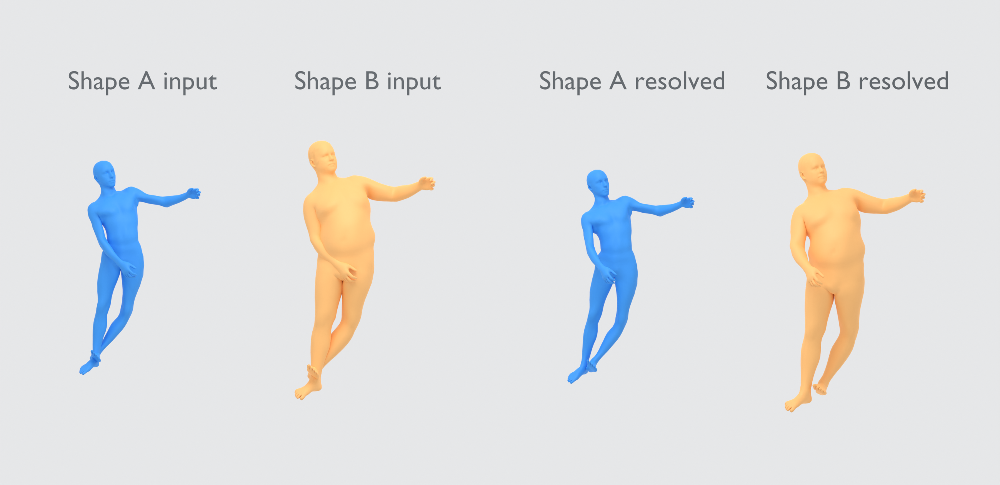

# Shape-Aware Collision Field Experimental Demo

This directory contains a minimal experimental shape-aware collision-field demo.
Given a fixed colliding SMPL-H pose and two SMPL body-shape coefficient vectors,
the demo loads the released checkpoint, resolves the pose for each shape, and
optionally exports the input and resolved meshes as OBJ files.

<p align="center">
  
</p>

## Prerequisites

Follow the main `README.md` first: create the PoseShield environment, install
the SMPL-H body model, and extract the optional SAField demo asset package.

## Run The Demo

Run the selected shape-aware optimization example:

```bash
python experimental/safield_demo/run_demo.py \
  --config_path experimental/safield_demo/sa_config.yaml \
  --examples_path experimental/safield_demo/demo_examples.json \
  --example_idx 0
```

This prints the SAField values before and after optimization for both body
shapes.

To also export OBJ meshes:

```bash
python experimental/safield_demo/run_demo.py \
  --config_path experimental/safield_demo/sa_config.yaml \
  --examples_path experimental/safield_demo/demo_examples.json \
  --example_idx 0 \
  --smpl_model_path deps/body_models \
  --output_dir experimental/safield_demo/output/example_0
```
